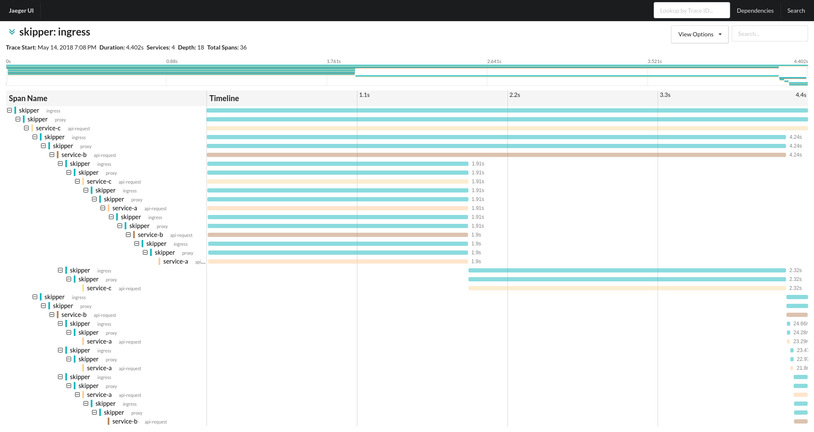

# tracing-example

A tracing example to show how it works [Kubernetes](https://kubernetes.io) and [Opentracing](http://opentracing.io/)

This example shows how the tracing acts in different endpoints and can be traced on each of the services using proxies.



## Componentes

* [skipper](https://github.com/zalando/skipper) (with [opentracing plugin](https://github.com/skipper-plugins/opentracing)) for sidecard proxyies
* [jaeger](https://www.jaegertracing.io) for tracing
* tracing-example app as the different services

## tracing-example app

Is a simple Go app made to create long and with huge call to other services that will be generated randomly.

Disclaimer: Is an example app to test tracing (no tests, not the best structure, developed very fast...)

The app has different endpoints:

* `/operation/fast-end`: Very fast rsponding endpoint.
* `/operation/slow-end`: Slow responding endpoint.
* `/operation/single-call`: Makes a call to another random service in a random endpoint before returning.
* `/operation/multiple-calls`: Makes multiple (random number) of calls to another random services in a random endpoints before returning.

With these different endpoints and multiple apps of this app running and connected we can create very long traces to check how everything is propagated and how the requests enter on the services through the sidecar proxies (skipper).

## Run on localhost

This will run 3 services (`service-a`, `service-b`, `service-c`) and infront of each service a sidecar proxy (trying to imitate Kubernetes on localhost for development) and the a jaeger stack in one single container (using memory as the store).

The example can be run on localhost using docker compose:

`make dev`

After this you can make a simple request to any of the different service endpoints:

* http://localhost:9090/operation/multiple-calls
* http://localhost:9091/operation/multiple-calls
* http://localhost:9092/operation/multiple-calls

And check the traces on Jaeger interface: http://localhost:16686

You can also have fun using [vegeta](https://github.com/tsenart/vegeta) :)

```bash
echo -e "GET http://localhost:9090/operation/single-call\nGET http://localhost:9091/operation/single-call\nGET http://localhost:9092/operation/single-call" | vegeta attack -duration=30s | tee results.bin | vegeta report
```

## Run on Kubernetes

TODO.
